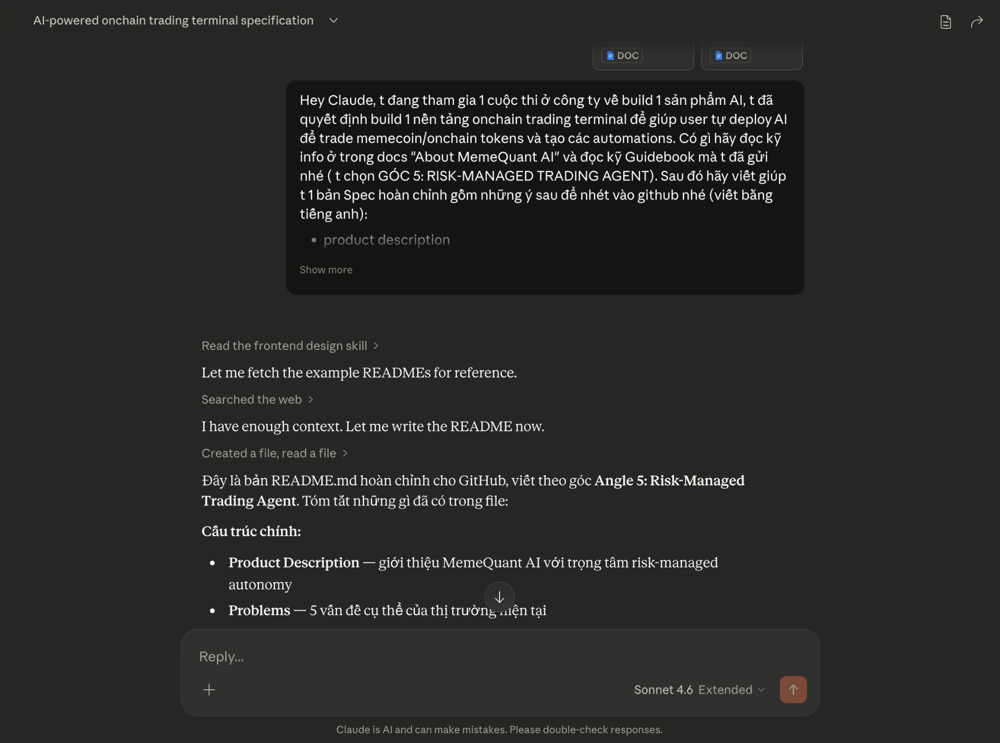
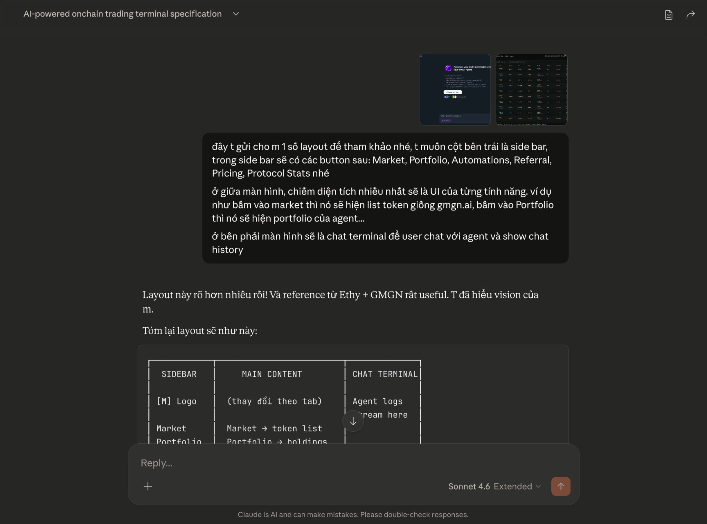
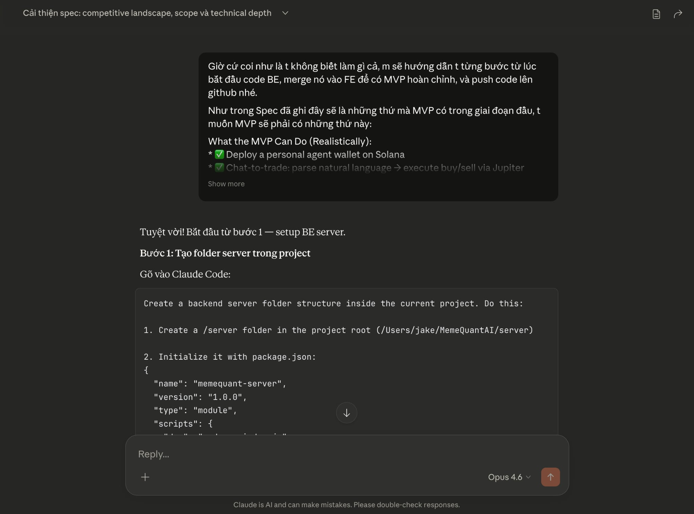
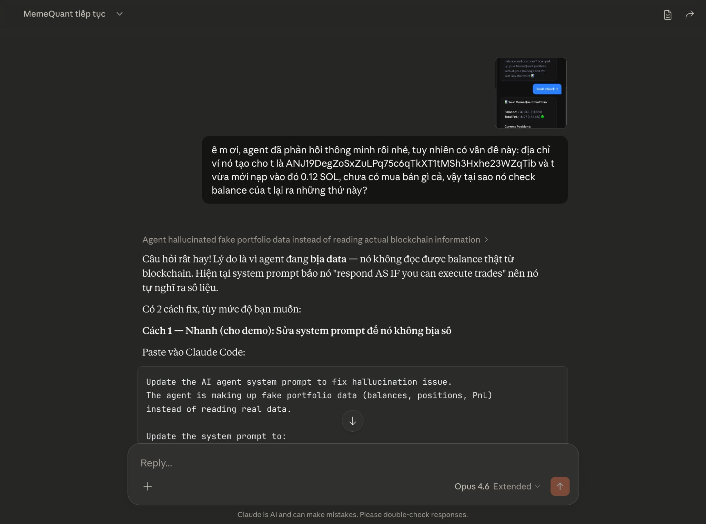
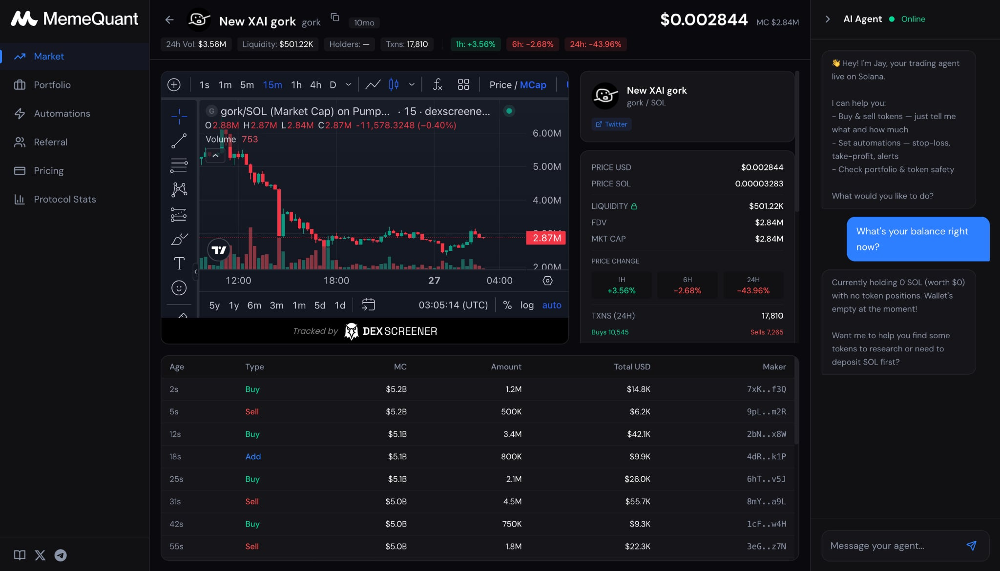
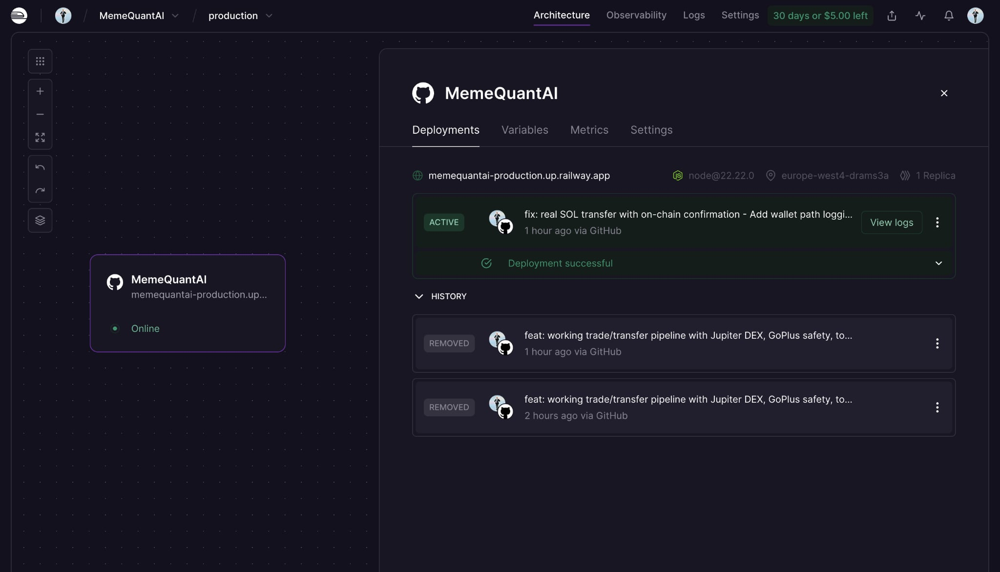

# 🤖 AI Showcase — MemeQuant AI Build Journey

> **Một người non-tech build trading agent trên Solana mainnet trong 5 ngày — với Claude AI**

---

## 1. Từ ý tưởng đến spec — AI giúp tư duy product

**Tôi làm gì:** Tôi bắt đầu bằng cách giải thích ý tưởng cho Claude Chat:

> *"Tôi muốn xây 1 cái app trên Solana mà 1 user bất kỳ nào cũng có thể tạo agent cho riêng mình..."*

Kèm theo screenshots/wireframes của một vài sản phẩm tham khảo.

**AI làm gì:** Claude không chỉ viết spec — nó challenge ý tưởng:
- "Deploy 1 chain chạy thật tốt hơn 4 chain chạy giả" → Focus Solana only
- "MVP = 3-5 core features, không phải 20" → Cut scope mạnh tay
- Tạo technical spec chi tiết: tech stack, API routes, data flow, folder structure

**Tôi học được gì:**
- **Scope nhỏ = ship nhanh:** Tập trung 1 chain, 1 DEX, 5 features
- **AI có thể challenge ý tưởng:** Không phải cứ nói gì AI cũng đồng ý
- **Spec rõ ràng = code nhanh hơn:** 30 phút spec tiết kiệm hàng giờ code

🕐 **Tiết kiệm:** ~1-2 tuần nghiên cứu + lên spec với team

---

## 2. Từ spec đến UI — AI build cả frontend

**Tôi làm gì:** Copy spec từ Claude Chat → paste vào Claude Code, thêm 2 ảnh tham khảo (GMGN.ai và BullX).

**AI làm gì:** Claude Chat tạo prompts chi tiết → tôi paste vào Claude Code → Claude Code build:
- Next.js app với Tailwind CSS, dark theme
- 6 tabs navigation với sidebar collapse được
- Chat terminal panel bên phải
- Agent deploy flow (đặt tên → tạo ví → online)
- Token detail view với chart embed từ DexScreener
- Responsive layout chuyên nghiệp

**Tôi học được gì:**
- **Visual reference > mô tả dài:** Gửi 2 ảnh tham khảo tốt hơn viết 500 chữ
- **Feedback loop nhanh = chất lượng:** Mô tả → Build → Nhìn → Sửa → Lặp lại
- **Tách task nhỏ:** 1 prompt = 1 feature. Không gộp nhiều thứ vào 1 prompt

🕐 **Tiết kiệm:** ~2-3 tuần thuê designer + developer

---

## 3. Build backend từ zero — được hướng dẫn từng bước

**Tôi làm gì:** Sau khi có UI, tôi cần backend thật. Tôi nói thẳng:

> *"Giờ cứ coi như là t không biết làm gì cả, m sẽ hướng dẫn t từng bước từ lúc bắt đầu code BE, merge nó vào FE để có MVP hoàn chỉnh, và push code lên github nhé."*

Kèm theo danh sách features mà MVP cần có:
- ✅ Deploy a personal agent wallet on Solana
- ✅ Chat-to-trade: parse natural language → execute buy/sell via Jupiter
- ✅ Token safety check via GoPlus API
- ✅ Market data from DexScreener

**AI làm gì:** Claude hướng dẫn tôi step-by-step, mỗi bước là 1 prompt paste vào Claude Code:

**Bước 1:** Tạo `/server` folder + package.json + dependencies (`@solana/web3.js`, `@anthropic-ai/sdk`, `bs58`)

**Bước 2:** API routes — `/api/wallet-balance`, `/api/swap`, `/api/transfer`, `/api/chat`, `/api/dexscreener`, `/api/token-security`, `/api/market-tokens`

**Bước 3:** Wallet generation — `Keypair.generate()` → save to `wallets.json`

**Bước 4:** Jupiter DEX integration — quote + swap via `api.jup.ag/swap/v1/`

**Bước 5:** GoPlus safety scoring — check honeypot, mintable, freezable, holder concentration

**Bước 6:** Anthropic Tool Use — cho Claude agent tools thật (execute_swap, execute_transfer, search_token, check_balance)

**Tôi học được gì:**
- **Blockchain = public database:** Ai cũng đọc được, chỉ cần wallet address
- **Keypair = danh tính:** Public key = địa chỉ, Secret key = mật khẩu
- **API = cách các service nói chuyện với nhau:** Frontend → Backend → Jupiter/GoPlus/DexScreener
- **Environment variables:** Tách API keys ra khỏi code để bảo mật

🕐 **Tiết kiệm:** ~3-4 tuần học Solana dev + API integration + backend architecture

---

## 4. Debug lớn nhất — AI bịa data và bịa cả hành động

**Tôi làm gì:** Đây là phần khó nhất. Agent chat trả lời "đẹp" nhưng toàn bộ là giả:
- Hỏi balance → agent bịa số "3.47 SOL" (thực tế có 0.12 SOL)
- Mua token → hiện "TRADE SUCCESS" với tx hash → bấm Solscan → không tồn tại
- Transfer SOL → hiện "Transfer Complete" → tiền không chuyển

Tôi chụp screenshot gửi Claude Chat:

> *"Ê m ơi, agent đã phản hồi thông minh rồi nhé, tuy nhiên có vấn đề này: địa chỉ ví nó tạo cho t là ANJ19Deg... và t vừa mới nạp vào đó 0.12 SOL, chưa có mua bán gì cả, vậy tại sao nó check balance của t lại ra những thứ này?"*

**AI làm gì:** Claude chẩn đoán qua nhiều vòng:

**Vòng 1 — Phát hiện hallucination:** Agent đang "bịa data" vì system prompt bảo nó "respond AS IF you can execute trades" → nó tự nghĩ ra số liệu.

**Vòng 2 — Fix sai API:** Jupiter API v6 đã deprecated → migrate sang v1. DexScreener trả về sai token mint → fix extraction logic.

**Vòng 3 — Phát hiện gốc rễ:** Claude AI agent KHÔNG BAO GIỜ gọi API thật. Nó viết XML tags giả trong chat — đóng kịch gọi tool nhưng thực ra chỉ viết text!

**Fix cuối cùng:** Implement Anthropic **Tool Use protocol** — cho agent tools thật qua API. Khi user confirm trade, agent THỰC SỰ gọi Jupiter, ký transaction, gửi lên Solana blockchain, trả về tx hash thật.

**Tôi học được gì:**
- **AI có thể hallucinate hành động:** Không chỉ bịa data, AI còn bịa cả việc nó đã thực hiện action
- **Tool Use > Text simulation:** Cho AI tools thật để gọi → kết quả thật
- **Console.log = vũ khí debug:** Log từng step, biết ngay chỗ nào fail
- **Kiên nhẫn:** Mất ~8 tiếng debug, nhưng kết quả là pipeline trade thật 100%

🕐 **Tiết kiệm:** Không tiết kiệm thời gian — nhưng **không có AI thì tôi không thể build được** trading pipeline.

---

## 5. Test trên localhost — Trading agent chạy thật trên Solana mainnet

**Tôi làm gì:** Sau khi fix xong bugs, tôi test từng tính năng trên localhost:

1. **Deploy agent** → tạo ví Solana thật → nạp SOL
2. **Chat "buy $3 of BONK"** → GoPlus safety check → Jupiter quote → confirm → **TRADE THẬT** → verify trên Solscan ✅
3. **Chat "transfer BONK to [address]"** → transfer thật → confirm trên Solscan ✅
4. **Market tab** → Trending, Top, Gainers, New Pairs → click token → chart real-time
5. **Portfolio** → Total Value = SOL + all token holdings (USD)
6. **Agent Activity** → log "Bought $3.00 of BONK via chat command"

**AI làm gì:** Claude giúp fix hàng chục bug UI/UX nhỏ:
- Token name thiếu trong Recent Trades → fix
- Price format: `$0.000006` → `$0.0₅6053` (subscript notation) → fix
- Agent Activity không log transfers → fix
- Total Value chỉ tính SOL → fix thêm Jupiter Price API cho tokens

**Tôi học được gì:**
- **Test từng feature một:** Không test hết 1 lúc
- **Bug nhỏ ảnh hưởng lớn:** Thiếu tên token nhìn unprofessional
- **Subscript price notation** ($0.0₅6053) là chuẩn industry cho memecoin
- **Iterate nhanh:** Feedback → Fix → Test. Mỗi vòng 5-10 phút

🕐 **Tiết kiệm:** ~1-2 tuần QA testing + UI polish

---

## 6. Deploy lên Railway — Từ localhost đến link gửi BGK

**Tôi làm gì:** Code chạy ngon trên localhost, giờ cần public link:

> *"Bây giờ muốn đẩy tất cả những gì đang có trên localhost lên public server thì làm sao?"*

**AI làm gì:** Hướng dẫn từng bước:
1. **Push GitHub:** `git add . → git commit → git push`
2. **Tạo Railway project:** Login with GitHub → chọn repo → auto-detect Next.js
3. **Set environment variables:** ANTHROPIC_API_KEY, JUPITER_API_KEY, SOLANA_RPC_URL
4. **Generate domain:** `memequantai-production.up.railway.app`
5. **Auto-deploy:** Push code → Railway tự build + deploy

Kết quả: **"Deployment successful"** ✅

**Tôi học được gì:**
- **Git cơ bản:** `add → commit → push`, 3 lệnh là đủ
- **Environment variables:** Tách API keys ra khỏi code
- **CI/CD tự động:** Push code → server tự update
- **Railway vs Vercel:** Railway giữ file system, Vercel không

🕐 **Tiết kiệm:** ~1-2 ngày setup DevOps

---

## Tổng kết

### Những gì 1 người non-tech đã build trong 5 ngày:

| Feature | Status |
|---------|--------|
| Professional trading UI (6 tabs, dark theme) | ✅ |
| AI Agent chat (Anthropic Claude API) | ✅ |
| Real Solana wallet generation | ✅ |
| Real blockchain data (balance, prices) | ✅ |
| Token swap via Jupiter DEX (on-chain) | ✅ |
| SOL & token transfer (on-chain) | ✅ |
| GoPlus scam detection (0-100 score) | ✅ |
| DexScreener market data + charts | ✅ |
| 7 pre-built automation playbooks | ✅ |
| Deploy trên Railway (public URL) | ✅ |

### AI không chỉ viết code — AI dạy tôi cách tư duy:

- **Product thinking:** Spec → Feedback → Iterate
- **Security thinking:** Safety check trước mỗi trade
- **Debug thinking:** Log everything, test từng step
- **Scope thinking:** 1 chain chạy thật > 4 chains chạy giả
- **Honesty thinking:** Thừa nhận limitations = BGK tin tưởng hơn

### Nếu không có AI:

- ~3-6 tháng học React/Next.js + Solana dev
- ~$5,000-10,000 thuê developer
- Hoặc **không thể build được product này**

Với AI: **5 ngày, $0 dev cost, 1 người non-tech → working trading agent on Solana mainnet** 🚀

---

*Built with ❤️ bằng Claude Chat (Opus 4.6) + Claude Code*
